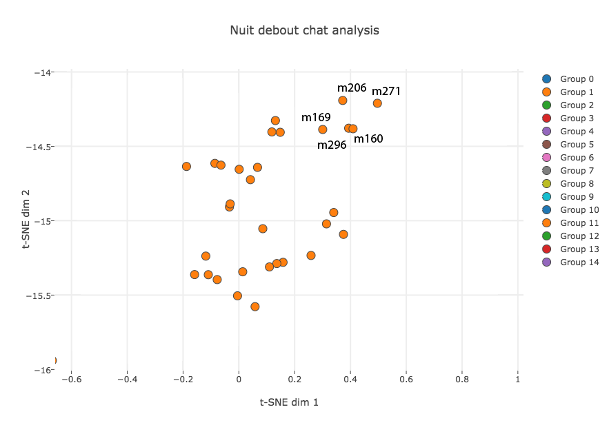

# Democrite
L'outil **Democrite** vise a transformer la démocratie participative en démocratie de l'émergence et permettre ainsi une vision fractale des discussions et des idées. Le but de ce système est d'effectuer une analyse sémantique d'un ensemble de discussions distribuées et indépendantes et de chercher la co-occurence d'idées même si celles-ci sont exprimées de manières différentes voir totalement inintelligibles.

## Démonstration (vite et sale)
Pour démontrer qu'un tel outil peut être potentiellement développé, nous avons décidé d'attaquer la forme la plus dure et désorganisée possible d'une conversation, le **chat**. Ainsi, nous avons pris 2.000 messages dans un segment aléatoire du canal *#acceuil* du salon de *NuitDebout* pour effectuer les analyses suivantes. (A noter que les messages sont d'abord traduits en anglais, car les modèles sémantiques sont beaucoup plus développés dans cette langue. Tous les détails techniques sont discutés dans la section **Explications techniques**)

**Emergence des idées** - Malgré le joyeux bordel, les messages ineptes (LOL, XD, ptdr) et donc évidemment l'orthographe déplorable, on peut construire un espace de *similarité sémantique des messages*


Cet espace en soit permet de regrouper les messages par leur *similarité sémantique sous-jacente*, faisant ainsi émerger les groupes de discussion automatiquement. Même si de nombreux groupes de messages ne concerne pas l'expression d'une idée (et d'ailleurs que la pluspart sont totalement incohérents) certains autres s'avèrent bien plus intéressants (version zoomée).


```
160 - release of sovereign debt by the francs citizens bank of france
* [0.137107] 169 - moreover once refunded sovereign debt which would take its meaning in a democracy this currency issued by citizens bank of france would fund a social policy socialism under the control of citizens who could vote in general meetings the main guidelines this policy funded by francs not so in the voting booth and apply when doing consensus
* [0.270835] 206 - if we use that come francs a citizens bank managed and directed by the citizens voluntarily by sacrificing for the franks who collected with reimburses the capital of the sovereign debt at least we know what stick using francs we free of debt it opens in the future
* [0.313423] 271 - release of sovereign debt by the franc / r / nuitdebout
* [0.132708] 296 - @guigz out of as i have suggested is an idea subject to the consensus to use francs issued by a bank dependent citizens that underpin the project to release all sovereign debt in a first time then fund a social policy under the control of citizens
```

Les autres parties de ce groupe peuvent toucher à des idées plus larges

```
239 - Bank of France repays the capital of the sovereign debt (no interest)
* [0.000000] 414 - capital of the sovereign debt, a way to punish
* [0.279487] 417 - This currency in francs, without credit card or check, that parts and
* [0.197987] 317 - currency promoting an economy of peasants, artisans, small traders, and independent (no
* [0.219611] 427 - in a democracy, this currency issued by Citizens Bank of France would
* [0.209327] 429 - France would fund a social policy (socialism) under the control of citizens
* [0.194164] 432 - in general meetings the main guidelines this policy funded by francs (not
* [0.000000] 443 - An idea submitted to consensus Use francs In the Constitution, stipulate that:
* [0.132442] 334 - for me it is indeed one liberalizes currency or local currency
* [0.242192] 339 - plan in the genre with a Greek local currency remaining in the euro but nobody followed, in
* [0.150225] 351 - @cyrildelacour: yes but it would have a monopoly on the local currency, which would be guaranteed by the state
* [0.296034] 695 - independent voters, not a dependent citizen bank which uses the currency, not so difficult to understand, right?
```

A noter que l'algorithme ne **rejette aucun message**, c'est a dire qu'il n'effectue pas une **décision** ni un **filtre** mais bien plus une **organisation émergente** permettant de synthétiser les idées. Ainsi même les "idées solitaires" peuvent être évaluées. Cependant, nous tenons à insister sur le fait que dans la version actuelle du système, la grande majorité des groupes ne donne aucun résultat intéressant. Cependant, il faut aussi souligner le fait que l'analyse a été fait sur le canal de chat le moins thématique et le plus désorganisé possible. Il suffit alors d'imaginer ce que pourrait amener l'application d'une telle analyse sur des données un tant soit peu organisée et thématique.

**Résilience temporelle** - L'avantage d'un tel algorithme est qu'il n'a pas de Rolex (oui il a raté sa vie), cela lui permet donc de faire des liens entre idées quel que soit leur écart temporel (ici le lien est fait entre le message 200 et le message 2158, un écart de presque une semaine).
```
200 -  the key is to know that we want society
* [0.237814] 380 - wow you really want the media in general you know there's not that bad journalists
* [0.271753] 1333 - @nathaniel yes it can be done like that too but the tax system also allows a parallel system of black market i have not said i was against i said that we must take in account ^^ moreover the cost of smoking to society is not offset by what it pays in taxes so you must also think of balancing
* [0.233828] 1759 - but in the end it's so vague that i do not even know if that's what they want
* [0.222665] 2158 - this debate is of course what society do we want for tomorrow but if one succeeds in not opening the breach this debate is particularly cleaving
```

**Thématique linguistique** - L'algorithme peut aussi descendre à un plus bas niveau et construire des espaces de **thématiques** en analysant cette fois uniquement des fragments de phrase.

**Résumé automatique** - Un autre aspect de ces familles d'analyse est d'essayer d'effectuer un résumé automatique d'un ensemble d'avis ou d'une conversation entière.

## Explications techniques
**Democrite** est basé sur un ensemble d'algorithmes d'*apprentissage profond* (*deep learning*) venant du champ de recherche du *Natural Language Processing*. Il se base ainsi sur
- Word semantic embedding spaces (GloVe, Word2Vec)
- Sentence paraphrase detection and regression (Skip-thought vectors, Recursive auto-encoders)
- Automatic summary system

### Niveau -1 = Shitty old school word-based statistics (Wordclouds)
Les statistiques bas niveau de fréquence de mots (hashtable de base), est toujours très informative ...

|  # |  Raw  | # | F1 | # | F2 |
|-----|----|-----|----|-----|----|
|1877 | the|153|will|120|people|
|1129 | to |120|people|67|movement|
|872  | of |98|would|66|France|
|780  | is |87|because|45|system|
|723 | a  |85|against|42|exchange|
|706 | and|78|about|39|inciting|
|605 |not|77|take|35|social|
|586 | I |74|place|33|participants|
|53 | in |73|think|31|chatter|
|448 |that|68|like|31|currency|
|409 | you|67|movement|31|media|
|405 | it|66|France|30|Bank|
|336 | on|64|more|30|police|
|299 | @|59|make|28|contacting|

### Niveau 0 = Semantic word-based statistics

### Niveau 1 = Semantic fragment themes

### Niveau 2 = Idea emergence

### Niveau 3 = Automatic summary

## Collaboration et extension

ATTENTION: Le code proposé a été réalisé en 48 heures, j'ai donc fait tous les efforts possibles pour m'assurer que ce code soit aussi inefficace que possible et qu'il viole autant que possible toutes les conventions de style MATLAB. Si le code peut être rendu plus inefficace ou laid de quelque manière que ce soit, n'hésitez pas à me contacter pour que je puisse remédier à cela.

Pour les personnes intéressées à développer cet outil et lui faire véritablement atteindre son objectif à grande échelle, voici une liste (non exhaustive) des besoins immédiats et des idées permettant d'améliorer le système.
- Correcteur orthographique automatique
- Accès aux données de discussion
- Pré-traitement des messages
- Génération automatique des espaces

## Dépendances
Vu l'étendue d'action du programme, de nombreuses dépendances sont nécessaires. Malheureusement, certains modèles (notamment les espaces sémantiques de mots et les paramètres de réseau pour la détection de paraphrases) vont jusqu'à l'ordre du Gigaoctet. Cependant tous ces modèles sont disponibles sous licence GPL ou MIT aux adresses suivantes. 

## Requirements
Democrite a été testé sur Ubuntu 14.04 et MacOSX. Il nécessite les programmes suivants

## Licence
Tous les scripts et codes de Democrite sont sous licence GPL, et tous les outils utilisés sont également sous licence GPL, LGPL ou MIT.