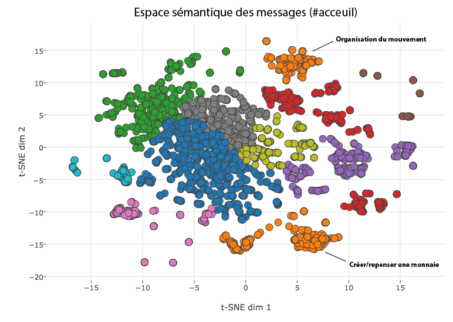

# Democrite
L'outil **Democrite** vise a transformer la démocratie participative en démocratie de l'émergence et permettre ainsi une vision fractale des discussions et des idées. Le but de ce système est d'effectuer une analyse sémantique d'un ensemble de discussions distribuées, désorganisées et indépendantes et de chercher la co-occurence d'idées même si celles-ci sont exprimées de manières différentes voir totalement inintelligibles.

## Démonstration (vite et sale)
Pour démontrer qu'un tel outil peut être potentiellement développé, nous avons décidé d'attaquer la forme la plus dure et désorganisée possible d'une conversation, le **chat**. Ainsi, nous avons pris 2.000 messages dans un segment aléatoire du canal *#acceuil* du salon de *NuitDebout* pour effectuer les analyses suivantes. (Tous les détails techniques sont discutés dans la section **Explications techniques**)

**Emergence des idées** - Malgré le joyeux bordel, les messages ineptes (LOL, XD, ptdr) et donc évidemment l'orthographe déplorable, on peut construire un espace de *similarité sémantique des messages*

Cet espace en soit permet de regrouper les messages par leur *similarité sémantique sous-jacente*, faisant ainsi émerger les groupes de discussion automatiquement. Même si de nombreux groupes de messages ne concerne pas l'expression d'une idée, certains autres s'avèrent bien plus intéressants (version zoomée).

A noter que l'algorithme ne **rejette aucun message**, c'est a dire qu'il n'effectue pas une **décision** ni un **filtre** mais bien plus une **organisation émergente** permettant de synthétiser les idées. Ainsi même les "idées solitaires" peuvent être évaluées.

De plus il faut aussi souligner le fait que l'analyse a été fait sur le canal de chat le moins thématique et le plus désorganisé possible. Il suffit alors d'imaginer ce que pourrait amener l'application d'une telle analyse sur des données un tant soit peu organisée et thématique.

**Résilience temporelle** - L'avantage d'un tel algorithme est qu'il n'a pas de Rolex (oui il a raté sa vie), cela lui permet donc de faire des liens entre idées quel que soit leur écart temporel.

**Thématique linguistique** - L'algorithme peut aussi descendre à un plus bas niveau et construire des espaces de **thématiques** en analysant cette fois uniquement des fragments de phrase.

**Résumé automatique** - Un autre aspect de ces familles d'analyse est d'essayer d'effectuer un résumé automatique d'un ensemble d'avis ou d'une conversation entière.

## Explications techniques
**Democrite** est basé sur un ensemble d'algorithmes d'*apprentissage profond* (*deep learning*) venant du champ de recherche du *Natural Language Processing*. Il se base ainsi sur
- Word semantic embedding spaces (GloVe, Word2Vec)
- Sentence paraphrase detection and regression (Skip-thought vectors, Recursive auto-encoders)
- Automatic summary system

### Niveau -1 = Shitty old school word-based statistics (Wordclouds)

### Niveau 0 = Semantic word-based statistics

### Niveau 1 = Semantic fragment themes

### Niveau 2 = Idea emergence

### Niveau 3 = Automatic summary

## Collaboration et extension

ATTENTION: Le code proposé a été réalisé en 48 heures, j'ai donc fait tous les efforts possibles pour m'assurer que ce code soit aussi inefficace que possible et qu'il viole autant que possible toutes les conventions de style MATLAB. Si le code peut être rendu plus inefficace ou laid de quelque manière que ce soit, n'hésitez pas à me contacter pour que je puisse remédier à cela.

Pour les personnes intéressées à développer cet outil et lui faire véritablement atteindre son objectif à grande échelle, voici une liste (non exhaustive) des besoins immédiats et des idées permettant d'améliorer le système.
- Correcteur orthographique automatique
- Accès aux données de discussion
- Pré-traitement des messages
- Génération automatique des espaces

## Dépendances
Vu l'étendue d'action du programme, de nombreuses dépendances sont nécessaires. Malheureusement, certains modèles (notamment les espaces sémantiques de mots et les paramètres de réseau pour la détection de paraphrases) vont jusqu'à l'ordre du Gigaoctet. Cependant tous ces modèles sont disponibles sous licence GPL ou MIT aux adresses suivantes. 

## Requirements
Democrite a été testé sur Ubuntu 14.04 et MacOSX. Il nécessite les programmes suivants

## Licence
Tous les scripts et codes de Democrite sont sous licence GPL, et tous les outils utilisés sont également sous licence GPL, LGPL ou MIT.